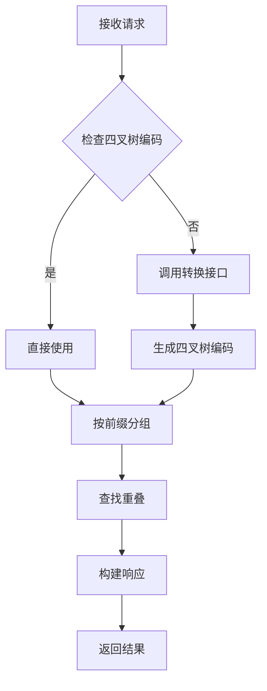

# PolygonOverlapSkill - 多边形重叠分析

## 📋 功能描述

该 Skill 用于执行两个多边形集合的重叠分析，支持自动检测和转换四叉树编码格式。

### 核心能力

1. **四叉树编码检查**：自动检测输入数据是否为四叉树编码格式
2. **智能转换**：将非四叉树编码的几何数据转换为四叉树编码
3. **重叠分析**：找出两个集合中具有相同空间位置的要素
4. **结果聚合**：按网格分组返回重叠详情

---

## 🔧 使用场景

### 典型应用场景

- **行政区划对比**：比较不同时期的行政区划变化
- **土地利用分析**：分析两个时期的土地利用变化
- **网格数据融合**：将不同来源的网格数据进行关联
- **空间关系查询**：查找具有空间重叠关系的要素对

### 触发条件

当用户意图包含以下关键词时，应调用此 Skill：

- "两个 polygon 求交"
- "多边形重叠分析"
- "空间交集"
- "要素对比"
- "变化检测"

---

## 📥 输入参数

### OverlapAnalysisRequest

| 参数名 | 类型 | 必填 | 说明 |
|--------|------|------|------|
| `polygonSetA` | List<PolygonInput> | ✅ | 第一个多边形集合（如：行政区划） |
| `polygonSetB` | List<PolygonInput> | ✅ | 第二个多边形集合（如：网格划分） |
| `includeDetails` | boolean | ❌ | 是否包含详细信息（默认 true） |

### PolygonInput

| 参数名 | 类型 | 必填 | 说明 |
|--------|------|------|------|
| `fid` | long | ✅ | 要素唯一标识符 |
| `code` | String | ✅ | 编码（可以是任意格式） |
| `bounds` | BoundingBox | ✅ | 边界框（用于四叉树编码转换） |

### BoundingBox

| 参数名 | 类型 | 必填 | 说明 |
|--------|------|------|------|
| `minX` | double | ✅ | 最小 X 坐标 |
| `minY` | double | ✅ | 最小 Y 坐标 |
| `maxX` | double | ✅ | 最大 X 坐标 |
| `maxY` | double | ✅ | 最大 Y 坐标 |

---

## 📤 输出结果

### OverlapAnalysisResponse

| 字段名 | 类型 | 说明 |
|--------|------|------|
| `totalOverlapGrids` | int | 重叠网格数量 |
| `totalOverlapUnits` | int | 重叠单元总数 |
| `details` | List<OverlapDetail> | 详细结果列表 |

### OverlapDetail

| 字段名 | 类型 | 说明 |
|--------|------|------|
| `gridKey` | String | 网格键（四叉树编码前缀） |
| `codes` | List<String> | 该网格内的所有 code |
| `fids` | List<Long> | 该网格内的所有 FID |
| `overlapPairs` | List<OverlapPair> | 重叠对列表 |

### OverlapPair

| 字段名 | 类型 | 说明 |
|--------|------|------|
| `fidA` | long | 集合 A 的 FID |
| `fidB` | long | 集合 B 的 FID |
| `codeA` | String | 集合 A 的 Code |
| `codeB` | String | 集合 B 的 Code |
| `representativeCode` | String | 代表性 Code（更长的那个） |
| `representativeFid` | long | 代表性 FID |

---

## 🔄 工作流程



---

## 💡 使用示例

### 代码示例

```java
// 创建 Skill 实例
PolygonOverlapSkill skill = new PolygonOverlapSkill();

// 构建请求
OverlapAnalysisRequest request = new OverlapAnalysisRequest();

List<PolygonInput> setA = Arrays.asList(
    new PolygonInput(1, "0123", new BoundingBox(100.0, 30.0, 101.0, 31.0)),
    new PolygonInput(2, "行政代码_A001", new BoundingBox(102.0, 32.0, 103.0, 33.0))
);

List<PolygonInput> setB = Arrays.asList(
    new PolygonInput(101, "0123", new BoundingBox(100.0, 30.0, 101.0, 31.0)),
    new PolygonInput(102, "GRID_B001", new BoundingBox(100.5, 30.5, 101.5, 31.5))
);

request.setPolygonSetA(setA);
request.setPolygonSetB(setB);

// 执行分析
OverlapAnalysisResponse response = skill.execute(request);

// 处理结果
System.out.println("重叠网格数: " + response.getTotalOverlapGrids());
System.out.println("重叠单元数: " + response.getTotalOverlapUnits());
```

### Function Calling 示例

```json
{
  "name": "polygon_overlap_analysis",
  "arguments": {
    "polygonSetA": [
      {
        "fid": 1,
        "code": "0123",
        "bounds": {
          "minX": 100.0,
          "minY": 30.0,
          "maxX": 101.0,
          "maxY": 31.0
        }
      }
    ],
    "polygonSetB": [
      {
        "fid": 101,
        "code": "0123",
        "bounds": {
          "minX": 100.0,
          "minY": 30.0,
          "maxX": 101.0,
          "maxY": 31.0
        }
      }
    ]
  }
}
```

---

## ⚙️ 四叉树编码规则

### 编码特征

- **字符集**：仅包含数字 0-3
- **长度**：通常为偶数（表示层级深度）
- **分隔符**：可能包含 `-` 或 `/`（会被自动清理）

### 示例编码

```
有效四叉树编码：
- "0123"       ✅
- "01230123"   ✅
- "01-23/01"   ✅ (分隔符会被移除)

无效四叉树编码：
- "A001"       ❌ (包含字母)
- "110000"     ❌ (包含数字 4-9)
- "行政代码"    ❌ (中文字符)
```

### 转换算法

当前实现使用简化的四叉树编码算法：

1. 计算边界框中心点
2. 在全局范围内递归细分
3. 根据中心点所在象限生成编码（0-3）
4. 默认细分 8 层（精度约 0.7 度）

**TODO**: 集成专业的四叉树库（如 GeoHash、S2 Geometry）

---

## 🚀 性能指标

| 数据规模 | 处理时间 | 内存占用 |
|----------|---------|---------|
| < 1,000 要素 | < 100ms | ~10 MB |
| 1,000 - 10,000 要素 | 100ms - 1s | ~50 MB |
| 10,000 - 100,000 要素 | 1s - 10s | ~200 MB |
| > 100,000 要素 | 建议使用分布式方案 | > 500 MB |

---

## ⚠️ 注意事项

### 边界条件

1. **空输入**：抛出 `IllegalArgumentException`
2. **混合编码**：自动检测并转换非四叉树编码
3. **缺失边界框**：降级使用 FID 作为临时编码
4. **超大范围**：建议先进行空间索引优化

### 精度限制

- 当前实现使用 8 层细分，精度约 0.7 度
- 如需更高精度，调整 `calculateQuadtreeCode()` 中的 `levels` 参数
- 注意：每增加 1 层，网格数量增加 4 倍

### 线程安全

- ✅ 支持多线程并发调用
- ✅ 内部状态隔离，无共享可变状态

---

## 🔗 相关组件

- **BasicUnit**: 基本单元数据模型
- **OverlapAnalyzer**: 重叠分析核心算法
- **LocalParallelProcessor**: 本地并行处理器（适用于大规模数据）

---

## 📝 开发指南

### 扩展四叉树编码服务

如需集成专业的四叉树编码库，修改 `convertToQuadtree()` 方法：

```java
private String convertToQuadtree(PolygonInput polygon) {
    // 方案1: 调用外部 API
    return QuadtreeService.encode(polygon.getBounds());
    
    // 方案2: 使用 S2 Geometry 库
    // return S2CellId.fromLatLng(...).toToken();
    
    // 方案3: 使用 GeoHash
    // return GeoHash.withCharacterPrecision(...).toBase32();
}
```

### 自定义分组策略

修改 `extractQuadtreePrefix()` 方法调整分组粒度：

```java
private String extractQuadtreePrefix(String quadtreeCode) {
    // 取前 2 位 -> 粗粒度分组
    // 取前 6 位 -> 细粒度分组
    int prefixLength = Math.min(6, quadtreeCode.length());
    return quadtreeCode.substring(0, prefixLength);
}
```

---

## 📖 参考资料

- [四叉树编码原理](https://en.wikipedia.org/wiki/Quadtree)
- [S2 Geometry Library](https://s2geometry.io/)
- [GeoHash 算法](https://en.wikipedia.org/wiki/Geohash)
